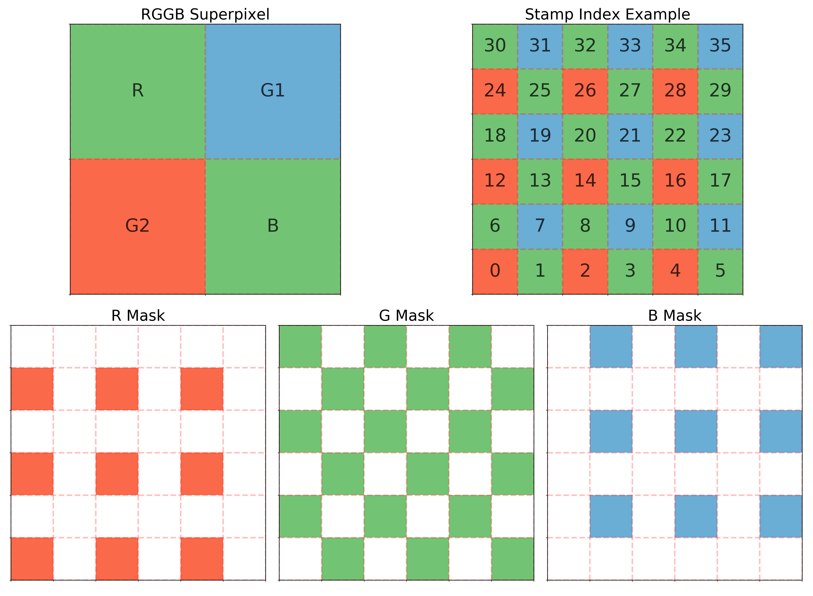
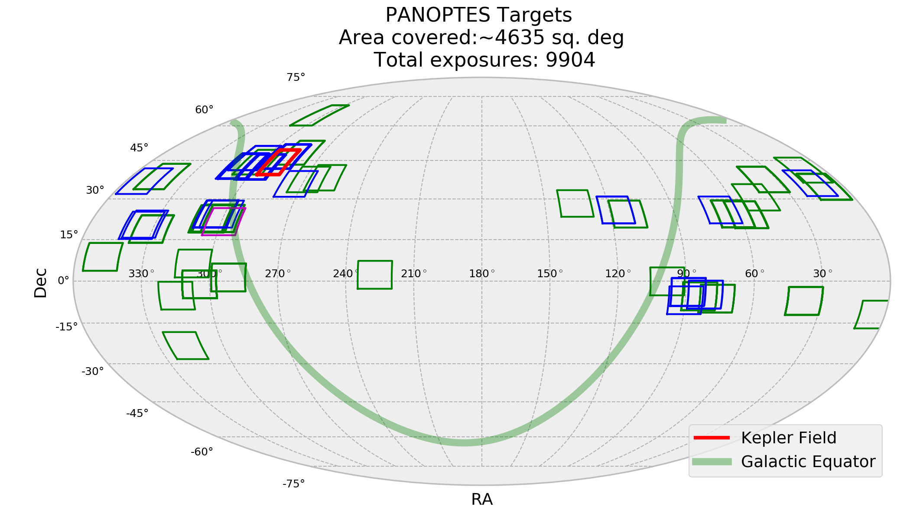
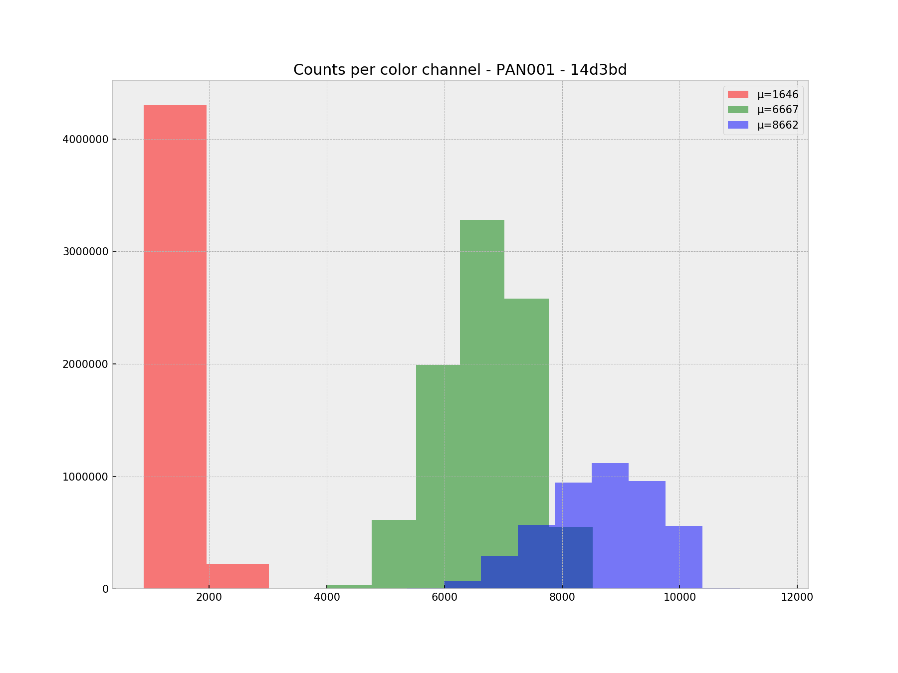
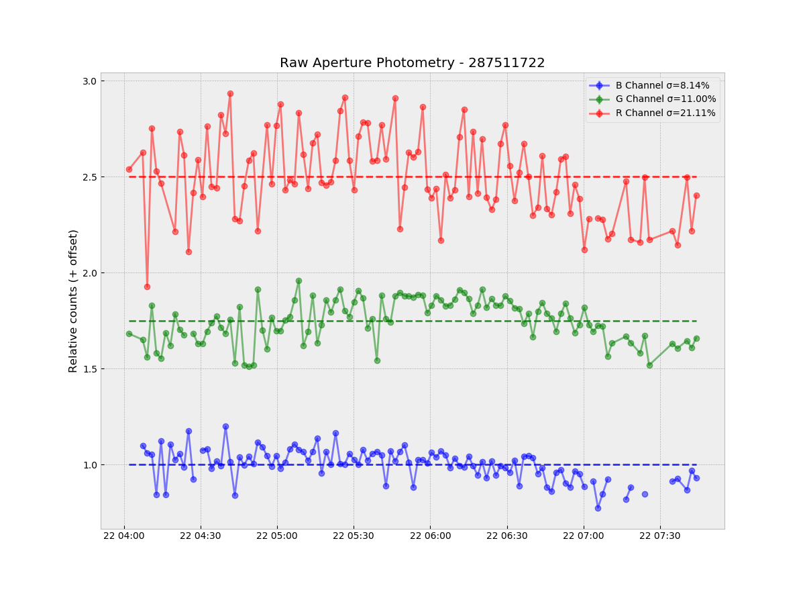

# PIAA Notebooks

This folder contains a number of jupyter notebooks that are used in various ways, either to explore the data or to help generate assets (e.g. figures for papers).

The notebooks are organized into subfolders depending on their functionality or what aspects of the system they involve.

### Assets

* **[Superpixels-And-Stamps](assets/Superpixels-And-Stamps.ipynb):** Generates an image of the superpixel as an example to be used in papers, etc.

  
  
* **[Observing-Run-Stats-and-FOV-Plot](assets/Observing-Run-Stats-and-FOV-Plot.ipynb):**  Aggregates the total number of images and exposure time for each sequence that has more than 30 minutes of exposure time. Also plots the FOV for all sequences. Meant to be informative but probably not exact. Also generates a latex table with same information.

  
  
* **[RMS-Explore](assets/RMS-Explore.ipynb):**  Create histograms of the RMS achienved for each source in the observation, split along color channels. _Note: This notebook uses the stored rms values inside an HDF5 file and requires that the file exist before-hand. The HDF5 file generation is changing somewhat so this notebook will inevitably be updated to support that. As such, not much work is going into it right now and this may not work._

### Camera

* **[Bias-Frame-And-Readnoise](camera/Bias-Frame-And-Readnoise.ipynb):** Generate a master bias frame and examine some of its properties. _Note: this notebook will generate a master bias frame from a combination of 100 individual bias frames. This can take a considerable amount of memory and probably should't be run locally._

* **[Flat-Frame-And-Gain](camera/Flat-Frame-And-Gain.ipynb):** Generate a master flat frame and examine some of its properties. Also compute a simple system gain.

  
  
### Observing

* **[Exoplanet-Info](observing/Exoplanet-Info.ipynb):** Generate a plot showing any observation sequences that overlap with actual known transits.

### Processing and Algorithm

* **[Algorithm](processing/Algorithm.ipynb):** Description of the algorithm, both in text and math. No code.

* **[Source-Detection-And-Filtering](processing/PIAA-Source-Detection-And-Filtering.ipynb):** Performs a basic source detection and catalog match. Detection is done via `sextractor` and the TESS Input Catalog (v6) is used for matcing. Default filtering is done via `sextractor` (with a custom params file) but additional sorting options are included in the notebook. Additional filtering done by default include a filter on the `sextractor` flags, a check that the source appears in 90% of all frames, and others. See notebook for details. The output from this notebook is a compressed CSV file saved in the observation directory with the name `point-sources-filtered.csv.bz2`. This source file is used for many of the notebook below.

* **[PSC-Creation](processing/PIAA-PSC-Creation.ipynb):** Generates a Postage Stamp Cube (PSC) for each detected source. PSCs are saved as CSV files in a subdirectory named `stamps` within the observation directory. Each csv file is named after the PICID, e.g. `stamps/256364928.csv`.

* **[Source-Noise](processing/PIAA-Source-Noise.ipynb):** Computes noise for each stamp within all PSCs for the observation. Noise is calculated for the stamp as a whole as well as each of the RGB channels. Output is saved as a CSV file in the observation directory with the name `point-sources-noise.csv`.

##### Processing Target

These notebooks are related to the processing algorithm but use a specific target to examine some of the details. The full algorithm would be run on all sources.

* **[Examine-Target-Noise](processing/PIAA-Examine-Target-Noise.ipynb):** This is a small notebook that takes the noise results from the [Source-Noise](PIAA-Source-Noise.ipynb) and examines them for a specific target. This also produces a basic plot of the aperture photometry (with no additoinal processing or calibration):

    
    
